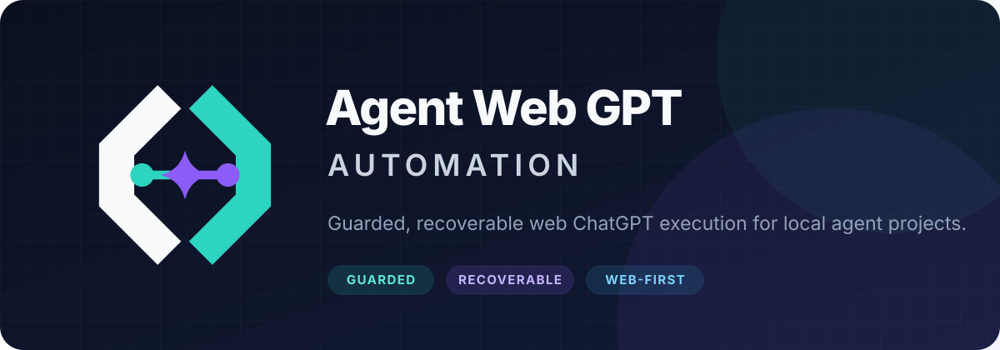

<p align="center">
  
</p>

<p align="center">
  <a href="https://github.com/ventianima-lab/codex-web-gpt-automation/actions/workflows/release-portability.yml"></a>
  <a href="https://github.com/ventianima-lab/codex-web-gpt-automation/releases/latest"></a>
  <a href="LICENSE"></a>
  
  
  
</p>

<p align="center">
  <strong>로컬 Codex 프로젝트에 웹 ChatGPT를 안전하고 복구 가능한 실행 계층으로 연결합니다.</strong>
</p>

<p align="center">
  한국어 · <a href="README.en.md">English</a> · <a href="docs/README.md">문서 전체 보기</a>
</p>

> [!IMPORTANT]
> 이 저장소는 커뮤니티 프로젝트이며 OpenAI의 공식 제품이 아닙니다. ChatGPT
> 로그인, Developer Mode 앱 등록, DevSpace Owner 승인은 사용자가 직접 수행합니다.

## 바로 시작하기

| 처음 설치 | 이미 설치됨 | 문제 해결 | 기여하기 |
|---|---|---|---|
| [최초 설치 가이드](docs/FIRST_INSTALL.md) | `python doctor.py`로 현재 상태 확인 | [진단·복구 문서](docs/README.md) | [기여 가이드](CONTRIBUTING.md) |

설치 → DevSpace exact root 등록 → Oracle 전용 브라우저 로그인 → ChatGPT 앱
`codex` 수동 등록 → 일반 비-Pro 연결 검사 순서로 진행합니다. 기존 설치를
업데이트할 때는 [최신 릴리스](https://github.com/ventianima-lab/codex-web-gpt-automation/releases/latest)의
변경 기록을 먼저 확인하세요.

## 왜 이 도구를 쓰나요?

| Guarded | Recoverable | Web-first | Cross-platform |
|---|---|---|---|
| 정확한 프로젝트 루트와 미션 SHA를 실행 전에 고정합니다. | 끊긴 실행을 새로 보내지 않고 기존 Oracle 세션에서 회수합니다. | 계획·리서치·구현·검토를 웹 ChatGPT 세션에 분리해 맡깁니다. | 영수증 기반 설치·롤백을 Windows와 macOS에서 검증합니다. |

Codex Web GPT Automation은 [Oracle](https://github.com/steipete/oracle)로
로그인된 ChatGPT 브라우저 세션을 실행하고,
[DevSpace](https://github.com/Waishnav/devspace)로 사용자가 허용한 프로젝트만
웹 GPT에 노출합니다. 로컬 Codex는 제출 신원, 복구, 해시, 최종 결정론적
테스트를 책임집니다.

```text
로컬 Codex
  └─ UTF-8 미션 + exact project root + SHA-256
       └─ Oracle → 로그인된 웹 ChatGPT 세션
            └─ DevSpace → 승인된 프로젝트만 읽기/작업
                 └─ 결과 회수 → 신원·해시·최종 gate
```

## 3분 설치

### Windows

```powershell
git clone https://github.com/ventianima-lab/codex-web-gpt-automation.git
cd codex-web-gpt-automation
.\install.ps1 -WhatIf
.\install.ps1
python doctor.py
```

### macOS

```bash
git clone https://github.com/ventianima-lab/codex-web-gpt-automation.git
cd codex-web-gpt-automation
python3 install.py --dry-run
python3 install.py
python3 doctor.py
```

대화형 최초 설치는 선택 기능인 Local Multi-GPT를 설치할지 묻고 기본값은
`No`입니다. 설치기는 기존 전역 파일을 백업하고 `~/.codex/receipts`에 영수증을
남깁니다. 설치 후 Codex를 재시작하세요.

> [!NOTE]
> 파일 설치만으로 ChatGPT 연결이 끝나지는 않습니다. 아래 최초 연결 절차를
> 한 번 완료해야 합니다.

## 최초 연결 순서

순서를 바꾸지 않는 것이 중요합니다. 전체 명령과 분기 기준은
[최초 설치 가이드](docs/FIRST_INSTALL.md)가 권위 문서입니다.

1. **고정 공개 경로 선택** — Tailscale Funnel 권장, Cloudflare Named Tunnel,
   ngrok 고정 도메인, custom HTTPS proxy 지원
2. **DevSpace 설정** — 사용할 모든 exact project root와 public origin 등록
3. **Owner 승인 정보 보존** — 암호를 CLI·Git·로그에 복사하지 않음
4. **상주 복구 검증** — 로그인 watchdog, local/public endpoint, root persistence 확인
5. **Oracle 전용 브라우저 로그인** — 일상 Chrome과 분리된 프로필
6. **ChatGPT 앱 수동 등록** — 이름 `codex`, URL `https://고정주소/mcp`
7. **일반 GPT 연결 검사** — Pro를 소비하지 않고 `@codex` read probe 수행

ChatGPT 앱 `codex` 등록은 준비가 끝난 뒤 **최초 한 번 수동 등록**하는
절차입니다. ChatGPT 설정·앱 목록·권한·삭제·선택 UI를 자동화하지 않습니다.

새 프로젝트를 추가할 때는 기존 root를 보존한 전체 목록에 exact folder만
추가합니다. 앱 설정은 매 작업마다 재검사하거나 자동 조작하지 않습니다.

## 모드 선택

| 원하는 결과 | 모드 | 실행 경로 |
|---|---|---|
| 질문·분석·작은 작업 | `direct` | Oracle + DevSpace |
| 구현 전 설계 | `plan` | 읽기 전용 웹 세션 |
| 코드·계획 독립 검토 | `review` | 읽기 전용 웹 세션 |
| 범위가 정해진 수정 | `edit` | 웹 구현·테스트 |
| 한 번에 끝내는 실행 | `orchestrator` | 단일 웹 세션 |
| 공개 자료 심층 조사 | `deep-research` | Oracle Deep Research |
| 독립 관점 병렬 탐색 | Web Multi-GPT | 여러 Oracle 세션 + merger |
| PC 로컬 자문·반례 탐색 | Local Multi-GPT | 선택 설치, Luna Max, 읽기 전용 |
| 계획부터 최종 gate까지 | comprehensive mode | 단계별 웹 워크플로 |
| 로컬 비용 최소화 | `ultra-economy` | Luna Max 지휘 + 분리 웹 단계 |
| Codex Ultra식 웹 분업 | `ultra-gpt` | 웹 planner/reviewer + 병렬 격리 worktree 구현 + merger/검증 |
| 명시 요청한 Pro 작업 | `pro` | GPT-5.6 Sol Pro + 읽기·쓰기 DevSpace |

자세한 선택 기준은 [전역 라우팅](docs/GLOBAL_CHATGPT_ROUTING.md),
[초절약모드](docs/ULTRA_ECONOMY_MODE.md),
[울트라 GPT 모드](docs/ULTRA_GPT_MODE.md)를 참고하세요.

## 실행 예시

프로젝트 안에 UTF-8 미션을 만들고 먼저 dry-run으로 신원을 확인합니다.

```powershell
python "$env:USERPROFILE\.codex\bin\chatgpt_oracle_dispatch.py" `
  --mode orchestrator `
  --project-root C:\project `
  --mission-path C:\project\mission.md `
  --manifest-output C:\project\.ai-bridge\oracle.json `
  --reasoning-level "Very High" `
  --dry-run
```

실제 실행 승인이 있을 때만 `--dry-run`을 제거합니다.

## 안전 계약

- 프로젝트마다 활성 또는 불확실한 Oracle 작업은 하나만 둡니다.
- 새 프로젝트의 첫 DevSpace 제출 전에 exact root 등록을 확인합니다.
- 일반 웹 작업은 최고 지원 비-Pro 추론 강도가 기본입니다. Pro는 횟수 제한이 있으므로 사용자가 명시적으로 요청할 때만 선택하며 자동 승격하지 않습니다.
- 명시적으로 선택한 Pro는 exact root 안에서 미션이 허용한 파일 쓰기와 명령 실행이 가능합니다. 저장소 안전 규칙과 `AGENTS.md`는 그대로 적용됩니다.
- 제출 후 오류는 기존 실행 신원으로 정확히 복구하며, 저장된 slug와 대화
  URL만 회수하고 자동 재제출하지 않습니다.
- 브라우저나 로컬 프로세스 종료만으로 웹 작업 실패를 판정하지 않습니다.
- 비밀, Owner 암호, OAuth 토큰, 브라우저 프로필은 저장소에 넣지 않습니다.
- `codexpro-*` 이름은 기존 영수증·스키마·복구 자산의 내부 호환 ID일 뿐,
  새 작업용 제품명이나 실행 경로가 아닙니다.

보안 문제는 공개 이슈 대신 [보안 정책](SECURITY.md)의 비공개 경로로 알려주세요.

## 문서 지도

| 시작 | 운영 | 고급 모드 | 프로젝트 |
|---|---|---|---|
| [최초 설치](docs/FIRST_INSTALL.md) | [DevSpace + Tailscale](docs/DEVSPACE_TAILSCALE_SETUP.md) | [초절약모드](docs/ULTRA_ECONOMY_MODE.md) · [울트라 GPT](docs/ULTRA_GPT_MODE.md) | [아키텍처 개요](docs/ARCHITECTURE.md) |
| [문서 인덱스](docs/README.md) | [전역 라우팅](docs/GLOBAL_CHATGPT_ROUTING.md) | [Local Multi-GPT](docs/LOCAL_MULTI_GPT.md) | [변경 기록](docs/CHANGELOG.md) |
| [기여 가이드](CONTRIBUTING.md) | [macOS Ultrawork](docs/MACOS_ULTRAWORK.md) | [레거시 경계](docs/FROZEN_LEGACY.md) | [버전 정책](docs/VERSIONING.md) |

## 버전과 지원

이 프로젝트는 `MAJOR.MINOR.PATCH` 형식의 [Semantic Versioning](https://semver.org/)을
사용합니다. `package.json`, `package-lock.json`, `install-manifest.json`, Git 태그와
GitHub Release가 같은 버전을 가리켜야 합니다. 업그레이드 전에는
[변경 기록](docs/CHANGELOG.md)을 확인하세요.

현재 검증 기준은 Oracle `0.17.1`, DevSpace `1.0.4`, Node.js `>=22.19 <27`,
Windows 11 및 macOS 12 이상입니다.

## 라이선스

[MIT License](LICENSE). Oracle·DevSpace 등 제3자 구성요소의 저작권과 라이선스는
[THIRD_PARTY_NOTICES.md](THIRD_PARTY_NOTICES.md)에 정리되어 있습니다.
