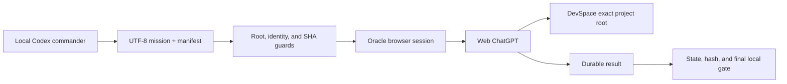

# Architecture

Codex Web GPT Automation is a guarded bridge between local Codex work and
signed-in web ChatGPT sessions. It does not replace Codex, Oracle, DevSpace, or
ChatGPT; it binds their identities and lifecycle into a recoverable workflow.

## Current execution path



| Layer | Owns | Must not own |
|---|---|---|
| Local Codex | scope, authorization, mission bytes, deterministic final checks | hidden web execution or guessed recovery |
| Dispatcher/state | exact root, model/effort, locks, hashes, lifecycle authority | semantic rewriting of completed web work |
| Oracle | signed-in browser session, model selection evidence, wait/harvest | project filesystem access outside DevSpace |
| Web ChatGPT | planning, research, implementation, review by selected mode | host credentials or unapproved roots |
| DevSpace | approved workspace tools and OAuth boundary | ChatGPT app registration automation |

## Guarded submission

Before a new project sends its first DevSpace-backed question, the normalized
project root must exactly match one current `allowedRoots` entry. Parent,
child, same-name, or other-drive paths are not substitutes. The qualification
is cached against the DevSpace config hash and repeated only when configuration
changes.

Every run records the project, mission bytes, transport, model, effort, and
artifact identity. Regular web work defaults to the highest supported non-Pro
reasoning tier. Pro is an explicit, quota-aware opt-in and uses exact-root
DevSpace with mission-scoped read/write authority. Attachment mode is an
explicit immutable-evidence contract, not an automatic fallback.

## Recoverable lifecycle

The project lock follows exact session authority:

```text
pre-submit -> submitted/unknown -> live -> terminal -> harvested
```

Authority is monotonic. A post-submit timeout never creates a replacement run;
recovery uses the persisted Oracle slug and conversation URL. A proven
pre-submit failure can be settled only through its supported evidence path.
Exact recovery uses a run-scoped mutex, not the project submission mutex. This
allows a prompt-free harvest of the same slug when a disconnected original
observer still owns the project mutex, while unresolved state continues to
block every fresh submission until terminal output is durably committed.

The 80-minute mark is a caution/status-audit threshold, not a deadline. The
host records exact-run liveness and artifact/terminal evidence and continues
the same process or exact-slug live observation. Elapsed time alone cannot
terminate a run, release its lock, mark it failed, or authorize a replacement.

## Staged workflows

- `orchestrator` is one authorized web implementation pass.
- comprehensive mode binds plan, review, implementation, and gates with
  per-stage identity and hash receipts.
- Web Multi-GPT runs genuinely independent Oracle sessions in bounded waves and
  merges compact handoffs.
- Local Multi-GPT is an optional read-only PC-local advisory tool.
- Ultra Economy Mode constrains local command to Luna Max and separates Pro
  design, web implementation, and web verification.
- Ultra GPT Mode replaces cognitive native subagents with bounded Oracle web
  sessions: a regular planner, reviewer/partitioner, parallel worktree-write
  Web Multi implementers, an all-lanes audit barrier, merger, and independent
  final verifier. Each writer receives a distinct pre-created Git worktree;
  host-validated disjoint project-relative ownership and actual-delta auditing
  prevent concurrent overlap before the combined result reaches canonical.
  Local Codex retains deterministic control and release duties.

## Installation lifecycle

The portable installer owns only files listed by `install-manifest.json`.
Before mutation it creates backups, a write-ahead log, and a receipt. Rollback
and uninstall are exact inverses for unchanged managed bytes; modified or
unmanaged destinations are preserved as conflicts.

## Compatibility boundary

`codexpro-*` and agbrowse assets are frozen identifiers for exact recovery of
persisted legacy work. New work uses Oracle. See [Frozen Legacy](FROZEN_LEGACY.md)
for the inventory and the versioned architecture files for historical details.
